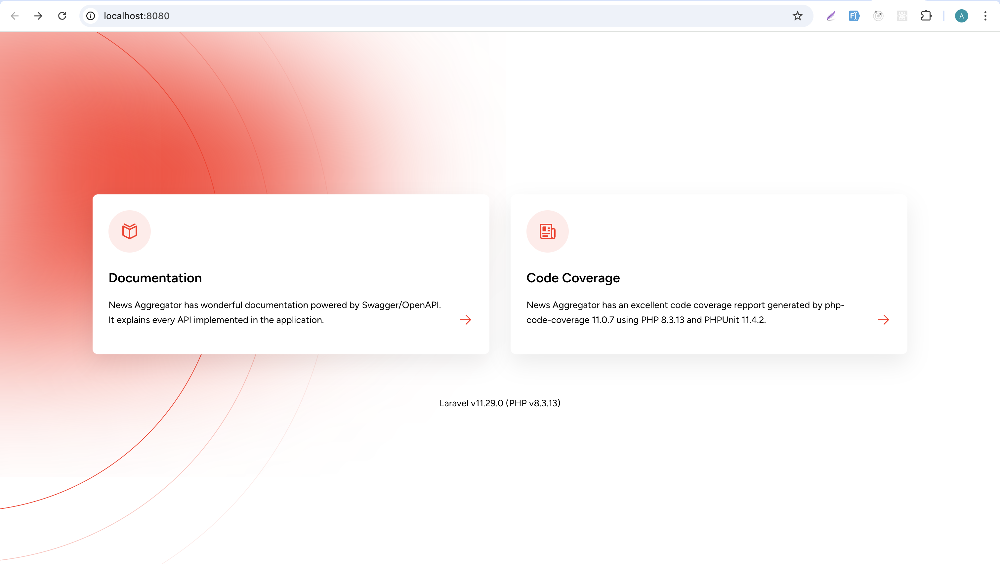
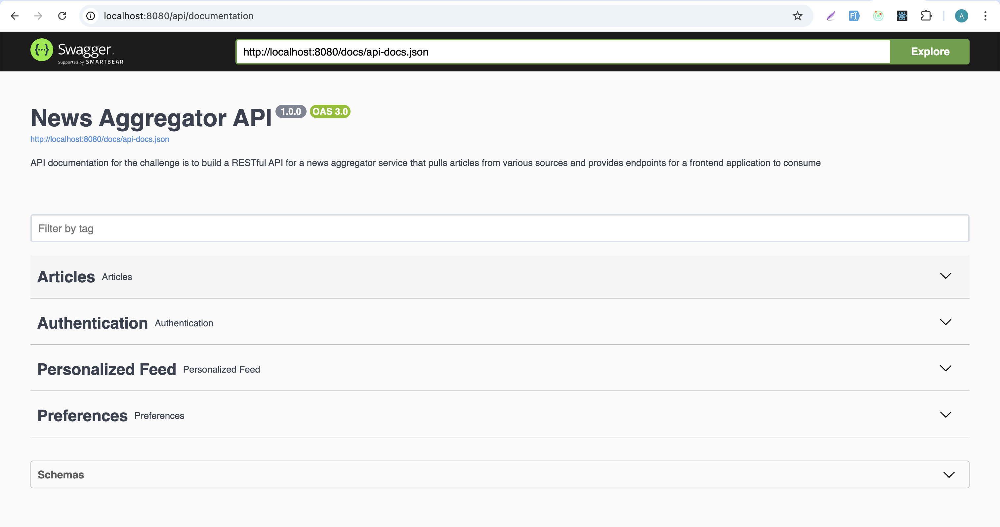
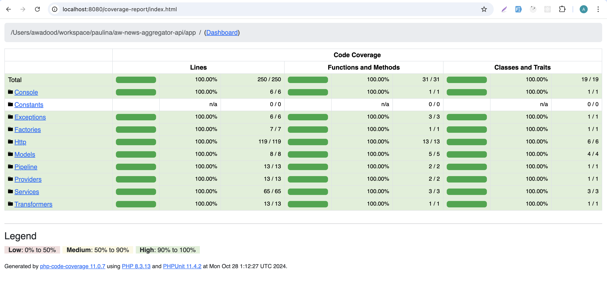

# News Aggregator API - README

This application is the implementation of the Backend Laravel Challenge. The [pdf document](./Backend%20Laravel%20Take-Home%20Challenge.pdf) is included in this repository.

## Prerequisites

To run this project, you must have **git**, **docker**, and **docker-compose** installed on your machine. Any recent versions of docker and docker-compose should work. However, their versions on my machine are:

-   **docker version** 27.2.0, build 3ab4256
-   **docker-compose version** v2.29.2-desktop.2

## Quick Start Guide

1. **Clone the Repository**

    Start by cloning the Git repository into a new directory:

    ```sh
    mkdir aw-news-aggregator-api
    cd aw-news-aggregator-api
    git clone https://github.com/awadood/aw-backend-dev-news-aggr.git .
    ```

2. **Run Docker Compose**

    Run the following command to build and start all services.

    ```sh
    docker-compose up --build -d
    ```

    This will set up the containers for:

    - **aw_news_aggregator**: Running the Laravel backend.
    - **nginx_server**: Serving as the web server.
    - **postgres_db**: Storing the application data.
    - **redis_cache**: For caching.

3. **Access the Application**

    After the services are up and running, you can access the application by navigating to:

    - [http://localhost:8080](http://localhost:8080) - This URL will be served by Nginx and the landing page will help you to access the **Documentation** and **Code Coverage Report** as shown in screenshots.
    - [http://localhost:8080/api/documentation](http://localhost:8080/api/documentation) - API Documentation
    - [http://localhost:8080/coverage-report/index.html](http://localhost:8000/coverage-report/index.html) - Code Coverage Report

4. **Stopping the Containers**

    To stop and remove the running containers, use the following command:

    ```sh
    docker-compose down
    ```

    This command will stop all running services and remove the containers. Data in PostgreSQL and Redis will be persistent across runs due to the use of Docker volumes.

## Screenshots







## Important Configuration Files

1. **articles.php**: This configuration file manages article-related settings, such as the number of articles to fetch, cron expressions, and caching options.

2. **fractal.php**: This configuration file handles the transformer settings for the application, defining how different data types and models are transformed before being returned by the API.

## Highlights

This application demonstrates my expertise in creating efficient, modular, and scalable solutions. Below are some key highlights that illustrate the strengths and uniqueness of this project:

1. **Optimized Database Schema with Attributes Table**: The schema leverages a flexible design where attributes of articles are stored in a separate table, making it easy to filter articles based on dynamic characteristics. This design also offers scalability and allows easy addition of new attributes without altering the core schema, making it highly extensible.

2. **Pipeline Design for Fetching Articles**: Implementation of a pipeline design pattern to fetch, transform, and store articles. This modular pipeline structure allows for easy extension as new data sources are integrated and makes the solution easy to maintain and providing clear separation of responsibilities. The fetcher classes themselves are designed to be easily configurable, making it straightforward to add, modify, or remove data sources.

3. **Optimized Insertion of Articles into Database**: The combination of hash checks and caching to ensure that duplicate articles are not inserted, significantly optimizing the insertion process, reducing redundancy, and ensuring the accuracy.

4. **Exception Handling**: Custom exception (`FetchFailedException`) is created for better error reporting, and rendering.

5. **Redis Caching**: Redis is used for caching to prevent duplicate API requests to external news services, reducing unnecessary data traffic and speeding up responses.

6. **Comprehensive API Documentation**: Swagger/OpenAPI based documentation for all endpoints, along with the standard code comments and non-documentational comments is added. This combination enables smooth onboarding for developers and ensures the documentation stays up-to-date with the implementation.

7. **Code Coverage Reports**: Automated test coverage with reports are included that show which parts of the codebase are covered by tests.

8. **CSS and Asset Configuration in Docker**: Issues with serving CSS and assets through Nginx are resolved, ensuring the coverage report and other assets display correctly.

## Contact

If you have any questions or run into any issues, you can reach me at **[awadoodraj@hotmail.com](mailto:awadoodraj@hotmail.com)** or **+49 151 5789 7159**.
